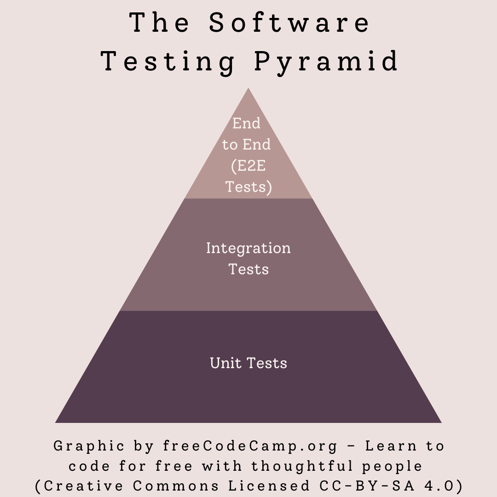
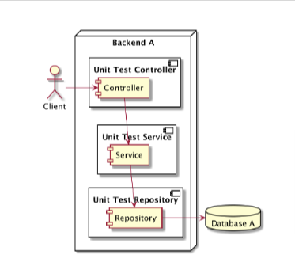

# # Unit-Testing

### Introduction

Software Testing merupakan salah satu disiplin ilmu dalam Software Engineering.
Tujuan utama dari Software Testing adalah memastikan bahwa kualitas Kode yang kita buat
dan aplikasi yang kita buat berjalan dengan baik.



Source : https://www.freecodecamp.org/news/types-of-software-testing/

---

### 1. End-To-End Test (E2E)

Dari gambar piramida testing diatas bahwa puncak dari Software Tensting yaitu
End-To-End Test (E2E). pengujian E2E adalah menguji seluruh komponen-komponen
yang ada pada aplikasi dari sisi UI (User Interface) hingga konektivitas-konektivitas
seperti jaringan, akses ke database, dan dependency external.


Source : Programmer Zaman Now - Java Unit Test ([URL](https://youtu.be/0jreaBRIOTo?si=8XAlh-byz-XWJEcG))

---

### 2. Integration Test

Integration Test adalah menggabungkan masing masing kompenen service dan mengujinya sebagai kelompok.
pegujian ini dilakukan untuk mengidentifikasi masalah dalam cara masing-masing komponen berinteraksi
satu sama lain untuk melihat apakah kode memenuhi spesifikasi fungsionalnya.


Source : Programmer Zaman Now - Java Unit Test ([URL](https://youtu.be/0jreaBRIOTo?si=8XAlh-byz-XWJEcG))

---

**_*Namun kali ini akan berfokus pada UNIT TESTING dan implementasinya menggunakan JAVA_**

## 3. Unit Testing

Unit Testing merupakan pengujian komponen kode individual, bukan kode secara keseluruhan.
Ini memverifikasi pengoperasian semua logika komponen seperti method untuk mengidentifikasi bug di awal, yang memungkinkan untuk diperbaiki kesalahan tersebut sebelum pengembangan lebih lanjut.



Source : Programmer Zaman Now - Java Unit Test ([URL](https://youtu.be/0jreaBRIOTo?si=8XAlh-byz-XWJEcG))

---

## *JUnit

JUnit merupakan Framework Test yang paling Poluler di Java.

> Official Documentation : https://junit.org/junit5/

### - Menulis Test

Di JUnit, kita bisa menambahkan @Test (Annotations) untuk menandai bahwa kode "Method" tesebut merupakan bagian dari test.

```java

package armul.java.junit;
import org.junit.jupiter.api.Test;

class CalculatorTests {

    private final Calculator calculator = new Calculator();

	@Test
	void testAddSuccess(){
		//Manual
//		if(result != 20){
//			throw new AssertionError("Test failed);
//		}
		var result = calculator.add(10,10);
		Assertions.assertEquals(20, result);

	}
}
```

### - Assertions

Saat menulis Test, ada baiknya kita mengetahui bahwa Test tersebut harus sesuai
dengan ekspetasi yang kita ingikan. Jika kita melakukan Test nya secara manual,
kita bisa menggunakan pengkondisian menggunakan IF ELSE, tetapi hal tersebut sangat tidak direkomendasikan, namun
Kita bisa menggunakan cara mudahnya menggunakan Class Assertions yang ada di JUnit.

```java
package armul.java.junit;
import org.junit.jupiter.api.Test;

class CalculatorTests {

    private final Calculator calculator = new Calculator();

    @Test
	@DisplayName("Test success method add(int, int)")
	void testAddSuccess(){
	
		var result = calculator.add(10,10);
		Assertions.assertEquals(20, result);

	}
}
```

### - Menggagalkan Test

ketika membuat Test kita tidak hanya membuat Test yang skenarionya sukses, namun
kita juga membuat Test yang skenarionya gagal. adakalanya kita ingin mengetes sebuah Exception,
Assertions juga bisa digunakan untuk mengecek apakah sebuah exception terjadi.

```java
    @Test
	@DisplayName("Test return throws exception method divide(int, int)")
	void testDivideThrow(){
		Assertions.assertThrows(IllegalArgumentException.class, () -> {
		calculator.divide(10,0);
		});
	}
```
